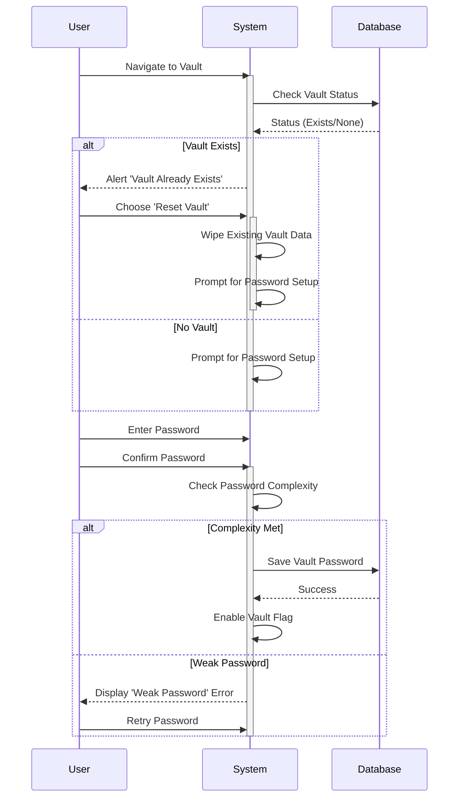

# Sequence Diagram: UC_VaultSetup (Setup Vault)

```mermaid
sequenceDiagram
    participant User
    participant System
    participant Database

    User->>System: Navigate to Vault
    
    activate System
    System->>Database: Check Vault Status
    Database-->>System: Status (Exists/None)
    
    alt Vault Exists
        System-->>User: Alert 'Vault Already Exists'
        User->>System: Choose 'Reset Vault'
        
        activate System
        System->>System: Wipe Existing Vault Data
        System->>System: Prompt for Password Setup
        deactivate System
    else No Vault
        System->>System: Prompt for Password Setup
    end
    deactivate System

    User->>System: Enter Password
    User->>System: Confirm Password
    
    activate System
    System->>System: Check Password Complexity
    
    alt Complexity Met
        System->>Database: Save Vault Password
        Database-->>System: Success
        System->>System: Enable Vault Flag
    else Weak Password
        System-->>User: Display 'Weak Password' Error
        User->>System: Retry Password
    end
    deactivate System
```
