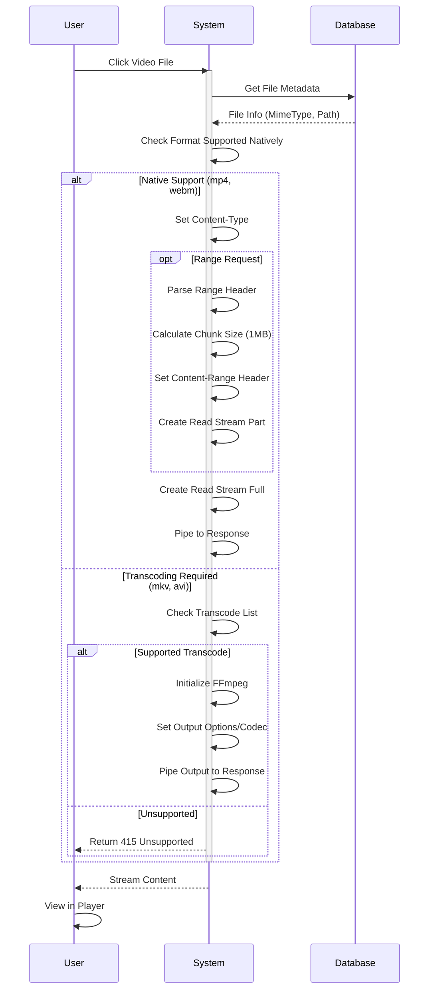

# Sequence Diagram: UC_View (View/Stream Media)

```mermaid
sequenceDiagram
    participant User
    participant System
    participant Database

    User->>System: Click Video File
    activate System
    System->>Database: Get File Metadata
    Database-->>System: File Info (MimeType, Path)
    System->>System: Check Format Supported Natively
    
    alt Native Support (mp4, webm)
        System->>System: Set Content-Type
        
        opt Range Request
            System->>System: Parse Range Header
            System->>System: Calculate Chunk Size (1MB)
            System->>System: Set Content-Range Header
            System->>System: Create Read Stream Part
        end
        
        System->>System: Create Read Stream Full
        System->>System: Pipe to Response
        
    else Transcoding Required (mkv, avi)
        System->>System: Check Transcode List
        
        alt Supported Transcode
            System->>System: Initialize FFmpeg
            System->>System: Set Output Options/Codec
            System->>System: Pipe Output to Response
        else Unsupported
            System-->>User: Return 415 Unsupported
        end
    end
    deactivate System

    System-->>User: Stream Content
    User->>User: View in Player
```
