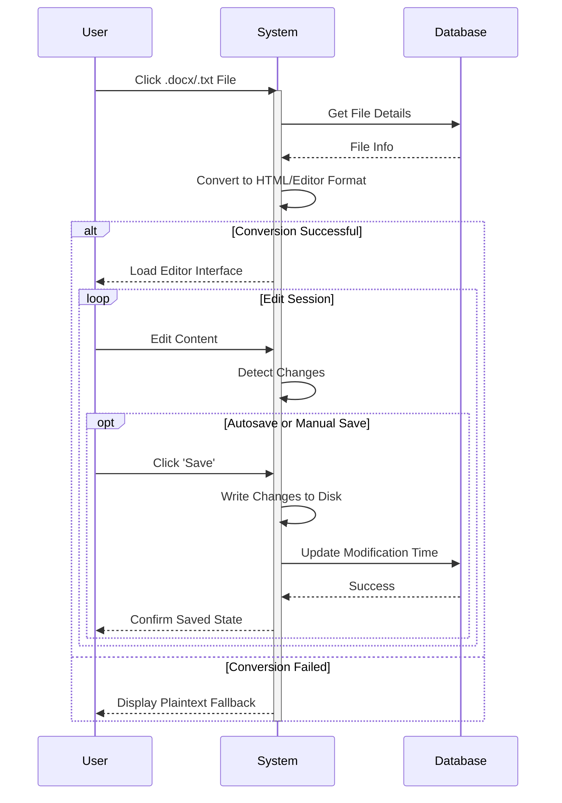

# Sequence Diagram: UC_docx (View/Edit Document)

```mermaid
sequenceDiagram
    participant User
    participant System
    participant Database

    User->>System: Click .docx/.txt File
    
    activate System
    System->>Database: Get File Details
    Database-->>System: File Info
    System->>System: Convert to HTML/Editor Format
    
    alt Conversion Successful
        System-->>User: Load Editor Interface
        
        loop Edit Session
            User->>System: Edit Content
            System->>System: Detect Changes
            
            opt Autosave or Manual Save
                User->>System: Click 'Save'
                System->>System: Write Changes to Disk
                System->>Database: Update Modification Time
                Database-->>System: Success
                System-->>User: Confirm Saved State
            end
        end
        
    else Conversion Failed
        System-->>User: Display Plaintext Fallback
    end
    deactivate System
```
