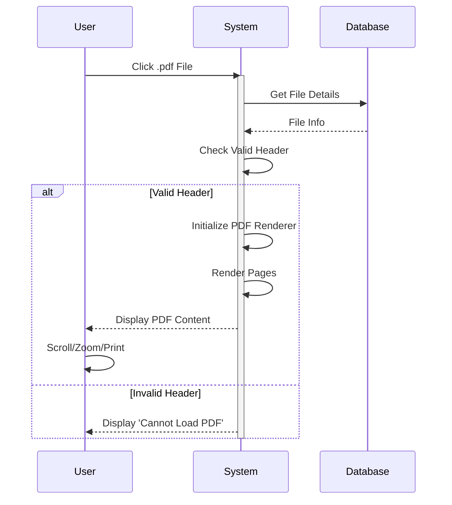

# Sequence Diagram: UC_pdf (View PDF)

```mermaid
sequenceDiagram
    participant User
    participant System
    participant Database

    User->>System: Click .pdf File
    
    activate System
    System->>Database: Get File Details
    Database-->>System: File Info
    System->>System: Check Valid Header
    
    alt Valid Header
        System->>System: Initialize PDF Renderer
        System->>System: Render Pages
        System-->>User: Display PDF Content
        User->>User: Scroll/Zoom/Print
    else Invalid Header
        System-->>User: Display 'Cannot Load PDF'
    end
    deactivate System
```
