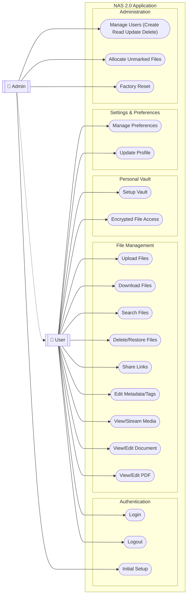

# NAS 2.0 Use Case Diagram

This diagram provides a high-level overview of the system's actors and their interactions with the various modules of the NAS 2.0 application.

```mermaid
flowchart LR
    %% Actors
    User[["👤 User"]]
    Admin[["👮 Admin"]]
    
    %% Inheritance
    Admin -.-> User
    
    subgraph System_Boundary [NAS 2.0 Application]
        direction TB
        
        %% Authentication Module
        subgraph Auth [Authentication]
            UC_Login([Login])
            UC_Logout([Logout])
            UC_Setup([Initial Setup])
        end
        
        %% File Management Module
        subgraph files [File Management]
            UC_Upload([Upload Files])
            UC_Download([Download Files])
            UC_Search([Search Files])
            UC_Del([Delete/Restore Files])
            UC_Share([Share Links])
            UC_Meta([Edit Metadata/Tags])
            UC_View([View/Stream Media])
            UC_docx([View/Edit Document])
            UC_pdf([View/Edit PDF])
        end
        
        %% Vault Module
        subgraph Vault [Personal Vault]
            UC_VaultSetup([Setup Vault])
            UC_VaultLock([Encrypted File Access])
        end
        
        %% Settings / User Module
        subgraph Settings [Settings & Preferences]
            UC_Prefs([Manage Preferences])
            UC_Profile([Update Profile])
        end
        
        %% Admin Only Module
        subgraph Admin_Mod [Administration]
            UC_ManageUsers(["Manage Users (Create Read Update Delete)"])
            UC_Allocate([Allocate Unmarked Files])
            UC_Reset([Factory Reset])
        end
    end

    %% Relationships - User
    User --> UC_Login
    User --> UC_Logout
    User --> UC_Upload
    User --> UC_Download
    User --> UC_Search
    User --> UC_Del
    User --> UC_Share
    User --> UC_Meta
    User --> UC_View
    User --> UC_VaultSetup
    User --> UC_VaultLock
    User --> UC_Prefs
    User --> UC_Profile
    User --> UC_docx
    User --> UC_pdf

    %% Relationships - Admin (Specifics)
    Admin --> UC_Setup
    Admin --> UC_ManageUsers
    Admin --> UC_Allocate
    Admin --> UC_Reset
```
